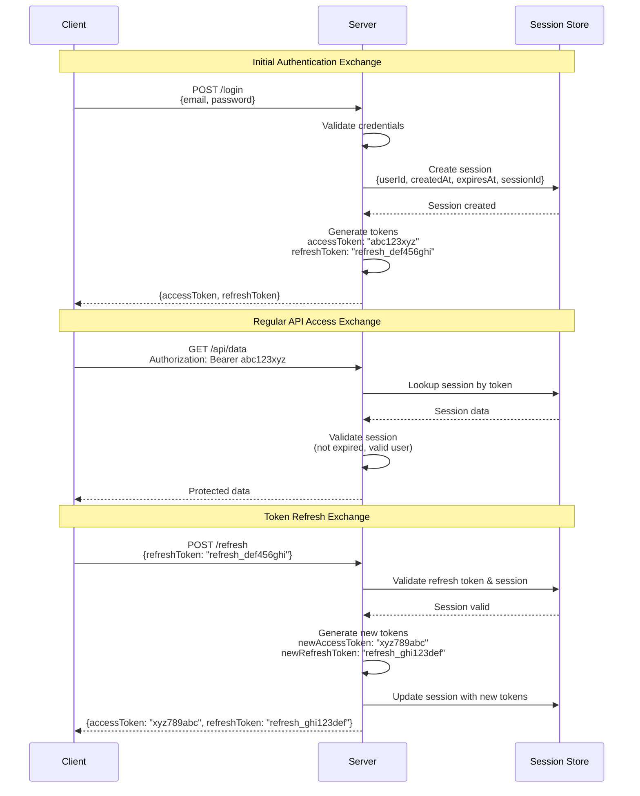
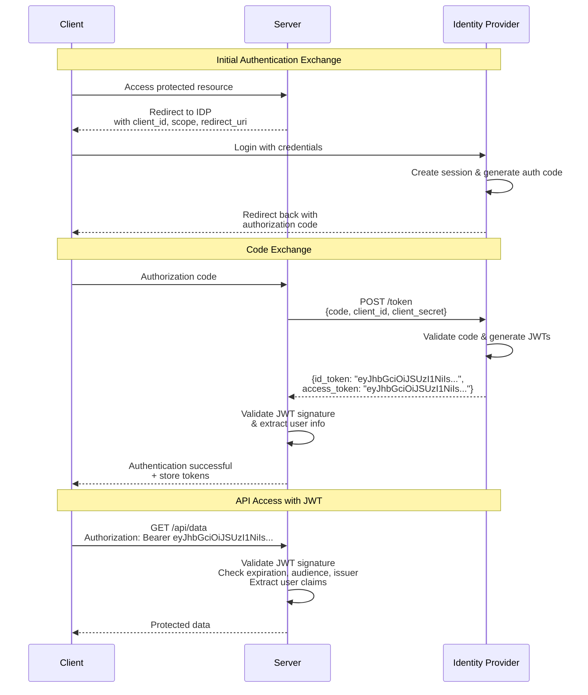

## Managing a State of Distrust

### Introduction

---

I believe that well-rounded engineers should understand the key parts of the system they are maintaining, even if they weren't the original authors or directly involved in the development of any given component of said system. So, I believe that if we are building an application that requires authentication, then we must be able to reason or communicate about it even if we are leveraging a third-party service to satisfy the application's auth requirements.

Today I want to share the mental model I use to reason about auth. My hypothesis is simple: Auth is about managing distrust, and the way we manage distrust is by leveraging sessions, tokens, and exchanges.

### State

---

State is a snapshot of data. It defines the characteristics of an entity at a specific point in time. It can be ephemeral (i.e., short-lived), fluid (i.e., always changing), or static (i.e., it rarely—or never—changes).

Every application must manage state. Most applications must implement state persistence. Out of these, a large subset must keep that data secure. In this case, the default is to distrust all requests to access the data, unless the client can prove that it should have access to it. This is the authentication challenge: creating and managing trust while maintaining distrust as the default.

### Trust

---

A server in a state of distrust will doubt every request, so the client must do something to gain its trust. Here are a few examples:

- The client tells a secret that only trustworthy entities would know.
- The client presents something that only trustworthy entities would possess.
- The client proves they are who they claim to be through inherent characteristics.
- The client established a trustworthy relationship in the past, and has evidence of it.
- The client is vouched for by another trustworthy entity that we can verify with.

### The Pillars

---

Authentication is simply the strategy, the process, on how to achieve trust between the client and the server. I base this strategy—and therefore, trust—on three fundamental pillars.

#### **Sessions**

The authenticated relationship between client and server, along with the data that describes it. **Sessions** are how we represent trusted state; they're the data structures that track authenticated relationships. Sessions don't store your actual application data, but rather the "relationship data". Who the user is, when they authenticated, when the session expires, and how to verify it's legitimate.

#### **Tokens**

The \***\*tangible representation of a session. **Tokens\*\* can either be opaque (e.g., a secure random string) or self-contained (e.g., a JWT). Clients exchange tokens for data, and servers use them to verify/validate that the client is authenticated and has access to that data.

#### **Exchanges**

The communication patterns that establish and verify trust between client and server. **Exchanges** typically follow a two-step pattern: first, the client provides proof of identity (credentials) and receives a token in return; then, for each subsequent request, the client presents the token and the server grants access after validating it represents a valid session.

### Examples

---

Now let's see how these three pillars work in practice. We'll look at two popular examples, and I'll leave the third as an exercise.

#### **Email and Password Authentication**

When a client submits their email and password, the server validates these credentials against stored user data. Upon successful validation, the server creates a **session**.

The server then generates two **tokens**: an access token (typically a short-lived opaque string like `abc123xyz`) that represents this authenticated session, and a refresh token (a longer-lived opaque string like `refresh_def456ghi`) that can be used to create new sessions when the current one expires. Since these are opaque tokens, the server stores a mapping between each token and its corresponding session data.

Where to store these tokens on the client side is somewhat outside our scope today, but as a rule of thumb: store refresh tokens in http-only cookies (for XSS protection), and access tokens either in JavaScript memory (most secure, but lost on page refresh) or session storage (survives refresh, slightly more XSS exposure). The choice depends on your security vs. user experience requirements. Avoid local storage for sensitive tokens.

The initial **exchange** is straightforward: credentials for tokens. Subsequent exchanges follow a pattern where the client presents their access token with each request, and the server uses that token to look up the corresponding session in its server-side store. When the access token expires, the client can exchange their refresh token for a new access token, effectively extending their authenticated relationship without re-entering credentials.

This approach allows the system to maintain stateful sessions on the server while giving clients portable tokens they can present as proof of their authenticated status.

#### **OpenID Connect**

When a client wants to authenticate via OpenID Connect, they're redirected to an identity provider (like Google or Auth0). After successfully authenticating with the provider, the server receives a **session** in the form of an authorization code that represents the client's authenticated state with the provider.

The server then **exchanges** this authorization code for **tokens**: an ID token (a JWT like `eyJhbGciOiJSUzI1NiIsInR5cCI6IkpXVCJ9...`) that contains the user's identity information, and typically an access token for API calls. Unlike opaque tokens, these JWTs are self-contained - they include the session data (user ID, expiration, issuer) encoded directly within the token itself, along with a cryptographic signature.

Since JWTs are self-contained, the server doesn't need to store a server-side mapping. Instead, it validates the JWT's signature using the identity provider's public key and checks the token's claims (expiration, audience, issuer) to ensure it's valid and trustworthy.

Token storage follows similar principles: store sensitive refresh tokens in http-only cookies when available, and handle ID/access tokens in JavaScript memory or sessionStorage based on your security vs. UX requirements.

Subsequent **exchanges** involve the client presenting their JWT with requests. The server validates the JWT cryptographically and extracts user information directly from the token's payload, without needing to look up session data in a database. When tokens expire, the client may need to re-authenticate with the identity provider or use a refresh token if available.

This approach delegates the complexity of user authentication to specialized identity providers while giving your system verifiable, self-contained tokens that prove the user's identity without requiring server-side session storage.

#### **Passkeys (WebAuthn)**

I'll leave Passkeys as an exercise for you. Using the **sessions**, **tokens**, and **exchanges** framework we've discussed, try reasoning through how authentication with Passkeys would work. Here are a few questions to think about:

**Core Questions**

- What constitutes the "session" in a Passkeys flow?
- Where is the session state maintained? Client-side, server-side, or both?
- What could serve as the "token"? Is it opaque or self-contained?
- Where is this token stored, and who has access to it?
- How does the server use this token to verify the user's identity?
- What does the initial exchange look like? What does the client provide, and what does the server return?
- How do subsequent API requests work? What does the client present as proof of authentication?
- What happens during the verification process? What is the server actually checking?

**Bonus Questions:**

- How does this compare to our previous examples in terms of security model?
- What role does the user's device/browser play in this authentication strategy?
- Where does the "trust" come from in this system? What makes it trustworthy?

**Resources**

If you don't know how WebAuthn credentials and Passkeys work, here are some useful resources:

- https://www.youtube.com/watch?v=sSxibbZ3GL4
- https://webauthn.guide/
- https://fidoalliance.org/passkeys/
- https://www.w3.org/TR/webauthn-2/

### Closing

---

I hope that these exercises made you realize (if you haven't already) that there's nothing arcane about auth. Authentication is just data flow with verification; understand these patterns and you can reason about any auth system. When evaluating different auth strategies, ask: How does it handle **sessions**? What **tokens** does it provide? What **exchanges** are required?

I usually don't encourage people to roll their own auth, but I strongly believe any competent engineer needs to have a good understanding of how it works; even if they're just going to use some third-party service like Clerk, or a library like Better Auth.

My opinion is that if you're building a real product that must generate revenue, you're probably better off by picking up a library or using a third-party service. Your focus should be building the core features of your product; but please, take time to understand how your app handles security and authentication. At worst, it will just make you a better engineer; at best, it will help keep your system secure and your users protected.

Thank you.

### References

---

- https://lucasacastro.com/writing/auth-101/
- https://thecopenhagenbook.com/
- https://www.youtube.com/watch?v=euKQWIEBYVU
